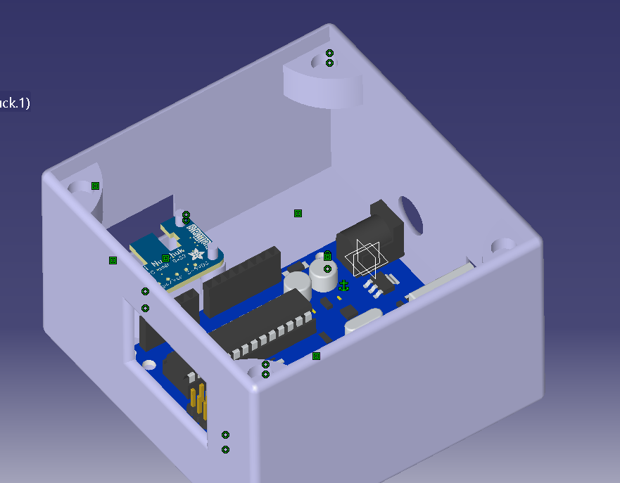

# 3DOF Robotic Arm — Wiimote Controll

A **3 Degrees of Freedom robotic arm** designed as a **hobby and learning project**, combining **mechanical design**, **embedded control**, and **intuitive human interaction**.

The robot is controlled in real time using a **Wiimote joystick**, allowing direct and intuitive manipulation of the arm joints and gripper.

  
  
  

---

## ✨ Project Overview

This project explores the full pipeline of a small robotic system:
- Mechanical design and 3D printing
- Embedded control with Arduino
- Human–machine interaction using a game controller

The focus is on **simplicity, accessibility, and experimentation**, rather than industrial-grade precision.

---

## 🤖 Robot Highlights

- **3 DOF articulated arm** (base, shoulder, elbow)
- **Servo-driven joints**
- **Elastic-return gripper**
- **Fully 3D-printed structure**
- **Real-time manual control**

The robot prioritizes **hands-on control and visual feedback**, making it ideal for demonstrations and experimentation.

---

## 🧠 Control & Software

The robot is controlled via:
- An **Arduino sketch (`.ino`)**
- A **visual block-based program (XOD)**

Both implementations achieve the same goal:
- Read joystick input
- Map input to servo motion
- Control the gripper via a button

This dual approach makes the project accessible to both **code-oriented** and **visual-programming-oriented** users.

---

## 🛠️ Manufacturing & Assembly

- All mechanical parts are **3D-printable**
- Designed in **CATIA**, assembled and validated in **Fusion**
- The system is intended for:
  - Desktop fabrication
  - Rapid iteration
  - Easy modification

---

## ⚠️ Current Limitations

- Motion is **not highly precise**
- Control can feel **shaky**
- Mechanical play and raw input mapping affect accuracy

These limitations are accepted trade-offs given the **hobbyist nature** of the project.

---

## 🚀 Purpose & Spirit

This project is meant to:
- Learn
- Experiment
- Prototype
- Have fun with robotics

It is **not an industrial robot**, but a **practical platform** to explore mechanics, electronics, and control in a hands-on way.

---

## 📌 Status

- [x] Mechanical design complete
- [x] Basic real-time control
- [x] 3D-printable and functional

