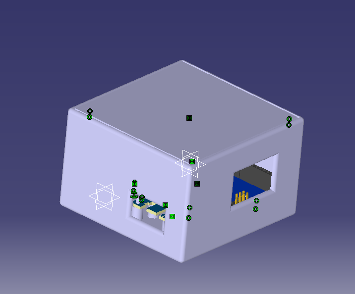

# Controller — Robot Arm Control Box

This folder contains the **controller enclosure and control logic** for the 3DOF robotic arm.

The controller is built around an **Arduino Uno R3**, stacked with a **servo shield**, and interfaced with a **Wiimote-to-Arduino module** to control the robot using a joystick and buttons.

---

## 🖼️ Visual Documentation

  
  
  

**Left**: Controller enclosure  
**Center**: Robot motion driven by joystick input  
**Right**: Internal electronics layout

⚠️ The **servo shield CAD model is not included** in the assembly.

---

## 🎮 Control Principle

- The **Arduino reads joystick values** from the Wiimote interface
- Joystick values are **mapped to servo angles**
- Each axis directly controls one joint:
  - Base
  - Shoulder
  - Elbow
- A **Wiimote push button** is used to:
  - Open / close the claw

This results in **direct, manual, real-time control** of the robot arm.

---

## 🧩 Electronics Overview

- **Microcontroller**: Arduino Uno R3
- **Servo Driver**: [SERVO SHIELD]
- **Wireless Input Module**: [WIIMOTE TO ARDUINO MODULE]

> Module names are intentionally left generic and can be specified later.

---

## 🔌 Power Architecture (Important)

- The system is **powered directly from the Arduino**
- The **servo shield draws power from the Arduino**
- The shield acts as a **power buffer / distribution layer**, allowing:
  - External current delivery to the servos
  - Protection of the Arduino logic circuitry
- This prevents **overcurrent damage** when driving multiple servos simultaneously

⚠️ Power management is functional but **not optimized**.

---

## 🏗️ Mechanical Design Notes

- The enclosure is designed to:
  - Stack the Arduino and servo shield
  - Secure the Wiimote interface module
- CAD files were:
  - Designed in **CATIA**
  - Exported as **CATPart / CATProduct**
  - Assembled and validated in **Fusion**
- The servo shield is **physically present but not modeled**

---

## ⚠️ Limitations & Known Issues

- Control is **shaky and imprecise**
- No filtering, dead zones, or smoothing applied
- Joystick-to-servo mapping is very direct
- Mechanical play + raw input = lack of precision

👉 This controller is suitable for:
- Demonstration
- Early prototyping
- Manual teleoperation

👉 It is **not suitable for precise motion control** in its current state.

---

## 🚀 Possible Improvements

- Input filtering (dead zones, low-pass filter)
- Better power separation (external servo supply)
- Improved enclosure stiffness
- More robust button handling for the claw
- Replace direct mapping with velocity-based control

---

## 📌 Status

- [x] Arduino + shield integration
- [x] Wiimote joystick control
- [x] Claw control via button
- [ ] Improved precision and stability needed
- [ ] Servo shield CAD model missing
