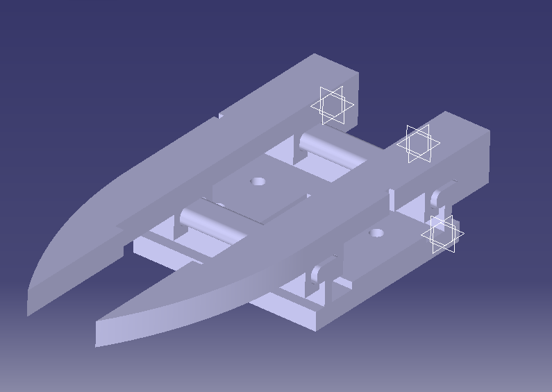

# Mechanical Design — 3DOF Robot Arm

This folder contains the **mechanical design** of a **3 Degrees of Freedom robotic arm** (base, shoulder, elbow) with a **servo-actuated claw**.

All parts are **fully 3D-printable** and were:
- **Designed in CATIA**
- **Exported to STL**
- **Assembled and validated in Autodesk Fusion**
- 
## 🖼️ Media 

## 🖼️ Visual Documentation

  
  
  

**Left**: Full robot mechanical assembly  
**Center**: Joint motion demonstration (claw excluded)  
**Right**: Claw mechanism close-up (elastic return system)

---

## 🦾 Robot Overview

- **DOF**: 3 (Base rotation, Shoulder, Elbow)
- **Actuation**: Servo motors
- **Manufacturing**: 100% FDM 3D printing
- **Assembly**: Fusion assembly at root level

The **Fusion assembly (`robot_3_DOF.f3d`) includes all mechanical parts except the claw**, which is currently handled separately.

---

## ✋ Claw / Gripper Design

The claw uses a **passive elastic return mechanism**:

- A **servo pulls the jaws apart** along linear rails
- An **elastic band provides the return force**, closing the jaws
- The servo is **not directly responsible for gripping force**, only for opening

### ⚙️ Design Intent
- Simple
- Lightweight
- Low servo load
- Easy to print and assemble

### ⚠️ Known Limitations
- The current claw mechanism is **mechanically fragile**
- Rails and jaw guidance **lack stiffness**
- Elastic-based return is **not yet optimized**

➡️ **The claw clearly needs improvement** (reinforcement, better guidance, or alternative mechanism).

---

## 🧩 Servos & Standard Parts

- STL exports of the **servo motors** used in the design are included
- Refer to the **`parts/` folder** to identify:
  - Servo dimensions
  - Mounting patterns
  - Standard components used in the assembly

---

## 🔩 Assembly & Printing Notes

- All parts are designed to be **3D-printable without exotic processes**
- **Threaded inserts are strongly recommended** for:
  - Servo mounting
  - Structural joints
  - Repeated assembly/disassembly

👉 Design already accounts for **insert-compatible holes**.

---

